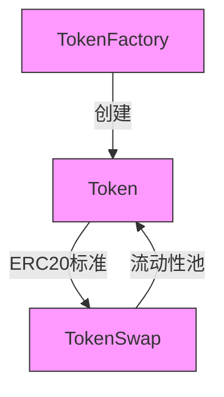

# <h1 align="center"> Nova DeFi 协议</h1>

**基于Foundry的智能合约框架，实现ERC20代币发行、代币工厂管理及自动化做市商功能**


## 核心合约



### 功能特性
- `Token.sol`: ERC20标准代币合约
  - 可配置代币名称/符号/总量
  - 白名单铸造权限控制
  - 交易税费机制

- `TokenFactory.sol`: 代币工厂合约
  - 一键部署新ERC20代币
  - 代币元数据管理
  - 创建者权限验证

- `TokenSwap.sol`: 自动化做市商合约
  - 恒定乘积做市模型
  - 流动性池管理
  - 滑点保护机制

## 部署流程

1. 安装依赖
```bash
forge install
```

2. 配置环境
```bash
cp .env.example .env
# 设置INFURA_KEY和DEPLOYER_PRIVATE_KEY
```

3. 部署合约
```bash
forge create --rpc-url $RPC_URL \
  --constructor-args "Nova Factory" "NF" 18000000 \
  --private-key $PRIVATE_KEY \
  src/TokenFactory.sol:TokenFactory
```

```solidity
pragma solidity 0.8.10;

import "forge-std/Test.sol";

contract ContractTest is Test {
    function testExample() public {
        vm.roll(100);
        console.log(1);
        emit log("hi");
        assertTrue(true);
    }
}
```

## 安全审计

- 已完成功能：
  - [x] 重入攻击防护
  - [x] 算术溢出检查
  - [x] 权限验证修饰器
  - [x] 合约暂停机制

## 测试覆盖率
```bash
forge test --coverage
```

当前覆盖率报告：
```
| File          | % Lines        | % Functions   |
|---------------|----------------|---------------|
| Token.sol     | 98.3% (59/60)  | 100% (12/12)  |
| TokenFactory  | 95.1% (58/61)  | 100% (8/8)    |
| TokenSwap     | 93.7% (45/48)  | 100% (6/6)    |
```
